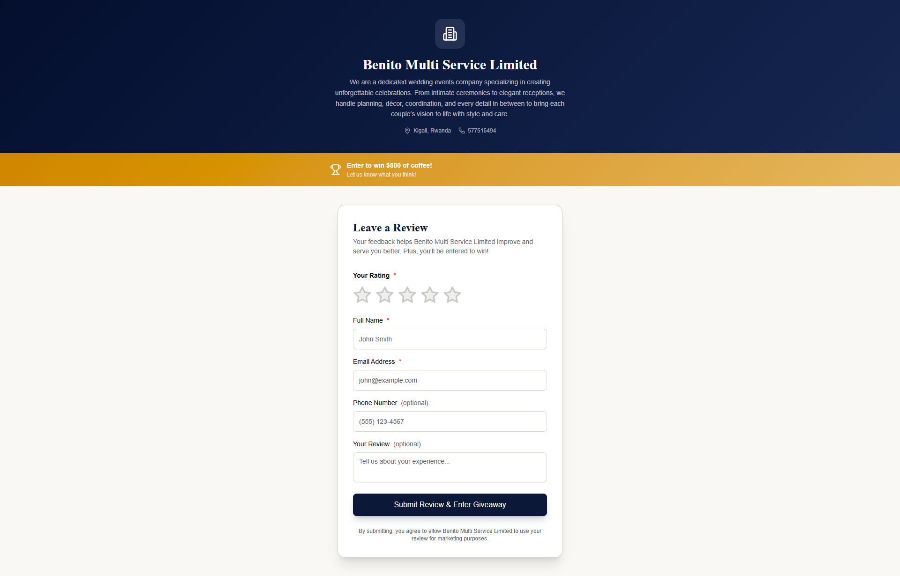
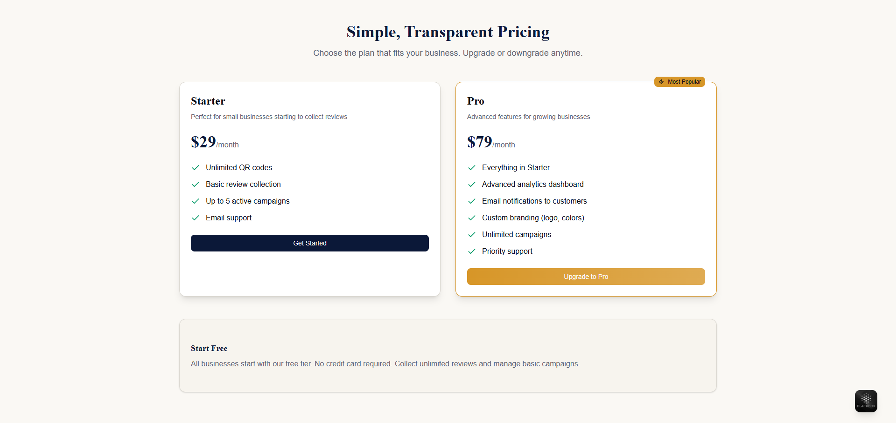
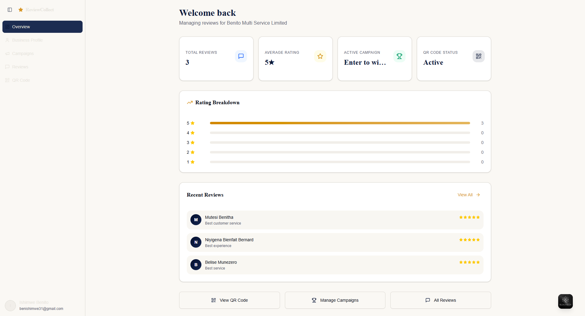
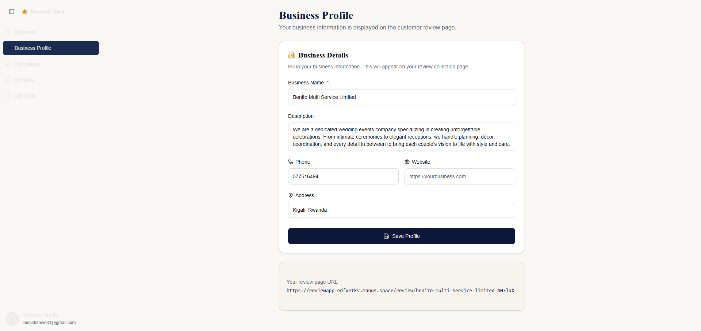
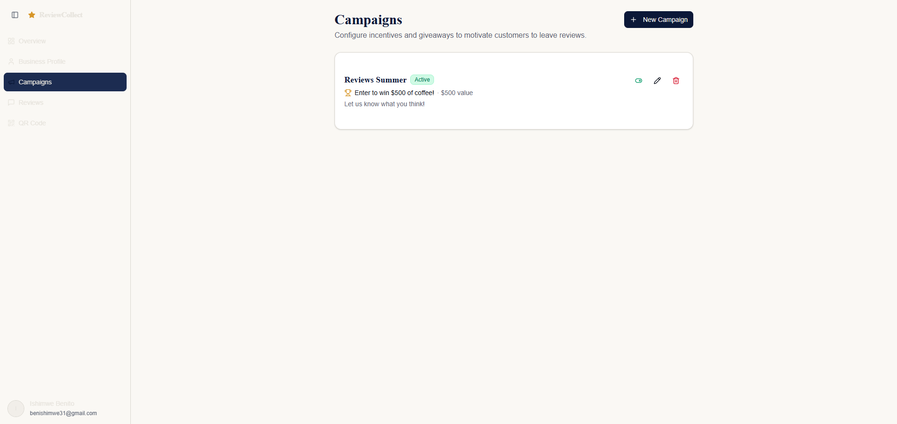
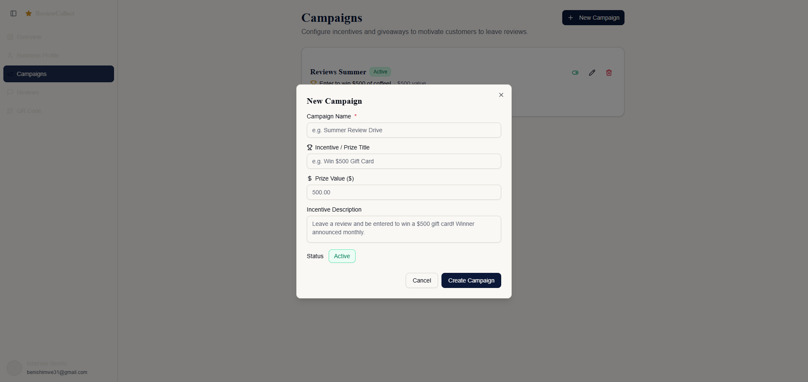
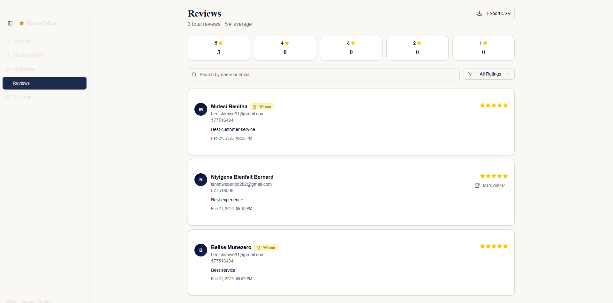
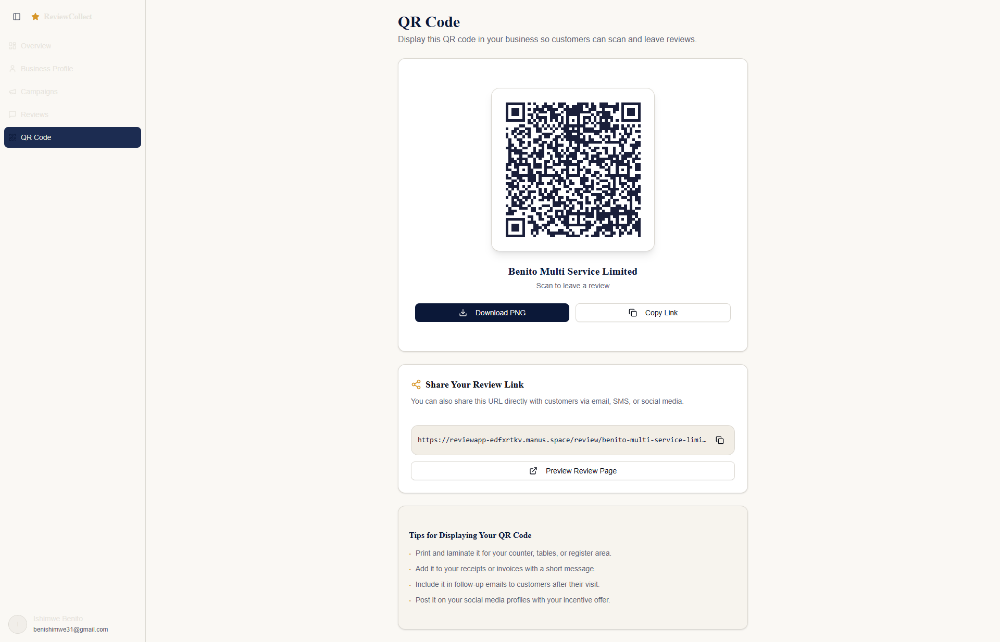
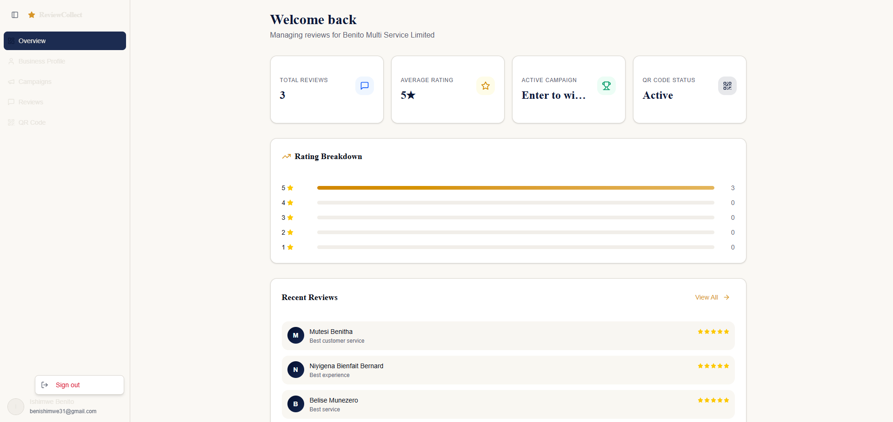

# ⭐ Review Collect

A QR-based review collection platform for local businesses.

## 🚀 Features
- Business registration
- QR code generation
- Customer review submission
- Business dashboard

## 🛠️ Tech Stack
- React / Vue
- Node.js / Python
- PostgreSQL / MongoDB

## 📸 Screenshots











## 📦 Installation
```bash
npm install
npm start
```

## 📜 License
MIT
